# Execute Summary

This report summarizes the findings from the penetration testing conducted on the new server that was hosted within the College Network. The server has many vulnerabilities on different ports and our aim is to identify or find as many vulnerabilities as possible to get into the server and to gain root access.

### Github Repo Link

* https://github.com/Rynorbu/SWS101

## Approach

### Information Gathering and Reconnaissance

I have performed network scans on different wifi on GCBS to identify open ports and running services on the target server (10.3.21.140).

After doing that I have gathered information about the server versions, and their vulnerabilities.

Then I attempted to exploit the identified vulnerabilities using Metasploit and other tools on many open ports.


## Scope

The scope of this test is to identify the vulnerabilities in the server and to exploit the vulnerabilities to gain access to the server. The server is hosted in the college network and the server has many open ports. The server has many vulnerabilities and our aim is to exploit the vulnerabilities and gain access to the server.

### Target Machine

The target machine is a Linux server with the following IP address: 

``` 10.3.21.140```

## Assessment Overview and Recommendations

During the penetration testing, I have identified 4 (four) vulnerabilities in the server. I was able to log in to the server MySQL port 3306 using the username root and able to run commands and see the databases. I didn't use any tools to exploit this server I just used the command line `mysql -h 10.3.21.140 -U root` and I was able to login to the database. I was able to see the database and the tables inside the database. This is a one vulnerability because the attacker can see the sensitive information that is inside the database and thus lead to loss of information and gain unauthorized access. 

Using the Metasploit I was able to exploit the Postgresql port 5432. I used the Metasploit module 'Postgres_login' to exploit the port. Just by saving some random username and password in the file and exploiting them to find the username and password to login into the server, I was able to find the correct username and password and login to the server. 

I was able to exploit ssh port 22 using the Metasploit module 'ssh_login'. I was able to find the username and password to login to the server. I have created a file called username.txt and password.txt and stored a list of usernames and passwords in that file. I used these files to find the username and password using brute force. After many attempts the username and password service was successful and I was able to login to the server and create files inside the server, I created a file called ranjung.

In the telnet server port 23 I have exploited using the Metasploit module 'telnet_login'. I was able to find the username and password to login to the server. I have created a file called "ranjung_in_telnet" inside the telnet server.

I was not able to exploit the reverse shell in the server. I have uploaded a file called 'new.php' in the dav directory and run the netcat command but I was not able to get the reverse shell.


# Network Penetration Test Assessment Summary

## Detailed Walkthrough

Different wifi in GCBS has differnt ports open on 10.3.21.140 Ip address. I have scanned all the wifi of GCBS and found that the SWE_OFFICE2 wifi has the most open ports. There are around 30 ports open in this wifi. Most of the ports version are outdated and have many vulnerabilities in this machine. 

    rybnorbu@lenevo-ranjung:~$ sudo nmap -sV 10.3.21.140
    Starting Nmap 7.80 ( https://nmap.org ) at 2024-05-04 11:29 +06
    Nmap scan report for 10.3.21.140
    Host is up (0.079s latency).
    Not shown: 944 closed ports, 32 filtered ports
    PORT     STATE SERVICE     VERSION
    21/tcp   open  ftp         vsftpd 2.3.4
    22/tcp   open  ssh         OpenSSH 4.7p1 Debian 8ubuntu1 (protocol 2.0)
    23/tcp   open  telnet      Linux telnetd
    25/tcp   open  smtp        Postfix smtpd
    53/tcp   open  domain      ISC BIND 9.4.2
    80/tcp   open  http        Apache httpd 2.2.8 ((Ubuntu) DAV/2)
    111/tcp  open  rpcbind     2 (RPC #100000)
    139/tcp  open  netbios-ssn Samba smbd 3.X - 4.X (workgroup: WORKGROUP)
    445/tcp  open  netbios-ssn Samba smbd 3.X - 4.X (workgroup: WORKGROUP)
    512/tcp  open  exec        netkit-rsh rexecd
    513/tcp  open  login?
    514/tcp  open  tcpwrapped
    1099/tcp open  java-rmi    GNU Classpath grmiregistry
    1524/tcp open  bindshell   Metasploitable root shell
    2049/tcp open  nfs         2-4 (RPC #100003)
    2121/tcp open  ftp         ProFTPD 1.3.1
    3306/tcp open  mysql       MySQL 5.0.51a-3ubuntu5
    4444/tcp open  backdoor    No-auth shell (**BACKDOOR**)
    5432/tcp open  postgresql  PostgreSQL DB 8.3.0 - 8.3.7
    5900/tcp open  vnc         VNC (protocol 3.3)
    6000/tcp open  X11         (access denied)
    6667/tcp open  irc         UnrealIRCd
    8009/tcp open  ajp13       Apache Jserv (Protocol v1.3)
    8180/tcp open  http        Apache Tomcat/Coyote JSP engine 1.1
    MAC Address: B4:69:21:0F:CE:9A (Intel Corporate)
    Service Info: Hosts:  metasploitable.localdomain, irc.Metasploitable.LAN; OSs: Unix, Linux; CPE: cpe:/o:linux:linux_kernel

    Service detection performed. Please report any incorrect results at https://nmap.org/submit/ .
    Nmap done: 1 IP address (1 host up) scanned in 59.27 seconds

As the server is also running on http server I used ffuf(brute force) to find the directories and files inside the server. I have found many directories and files inside the server. 

    rybnorbu@lenevo-ranjung:~$ ffuf -w /home/rybnorbu/SecLists-master/Discovery/Web-Content/common.txt -u http://10.3.21.140/FUZZ

            /'___\  /'___\           /'___\       
        /\ \__/ /\ \__/  __  __  /\ \__/       
        \ \ ,__\\ \ ,__\/\ \/\ \ \ \ ,__\      
            \ \ \_/ \ \ \_/\ \ \_\ \ \ \ \_/      
            \ \_\   \ \_\  \ \____/  \ \_\       
            \/_/    \/_/   \/___/    \/_/       

        v1.1.0
    ________________________________________________

    :: Method           : GET
    :: URL              : http://10.3.21.140/FUZZ
    :: Wordlist         : FUZZ: /home/rybnorbu/SecLists-master/Discovery/Web-Content/common.txt
    :: Follow redirects : false
    :: Calibration      : false
    :: Timeout          : 10
    :: Threads          : 40
    :: Matcher          : Response status: 200,204,301,302,307,401,403
    ________________________________________________

    .hta                    [Status: 403, Size: 288, Words: 22, Lines: 11]
    cgi-bin/                [Status: 403, Size: 292, Words: 22, Lines: 11]
    dav                     [Status: 301, Size: 313, Words: 21, Lines: 10]
    .htpasswd               [Status: 403, Size: 293, Words: 22, Lines: 11]
    .htaccess               [Status: 403, Size: 293, Words: 22, Lines: 11]
    index                   [Status: 200, Size: 568, Words: 80, Lines: 34]
    index.php               [Status: 200, Size: 568, Words: 80, Lines: 34]
    phpMyAdmin              [Status: 301, Size: 320, Words: 21, Lines: 10]
    phpinfo                 [Status: 200, Size: 48002, Words: 2409, Lines: 657]
    server-status           [Status: 403, Size: 297, Words: 22, Lines: 11]
    test                    [Status: 301, Size: 314, Words: 21, Lines: 10]
    twiki                   [Status: 301, Size: 315, Words: 21, Lines: 10]
    phpinfo.php             [Status: 200, Size: 48014, Words: 2409, Lines: 657]
    :: Progress: [4727/4727] :: Job [1/1] :: 67 req/sec :: Duration: [0:01:10] :: Errors: 2 ::

These are all the directories that are present in the server. It is good that the server-status is secure as I need permission to gain access to this directories.

## Discovered vulnerabilities

### ssh exploit

I was able to exploit most of the machine using metasploit. In order to exploit ssh server port 22 I used metasploit and used the ssh_login module.   

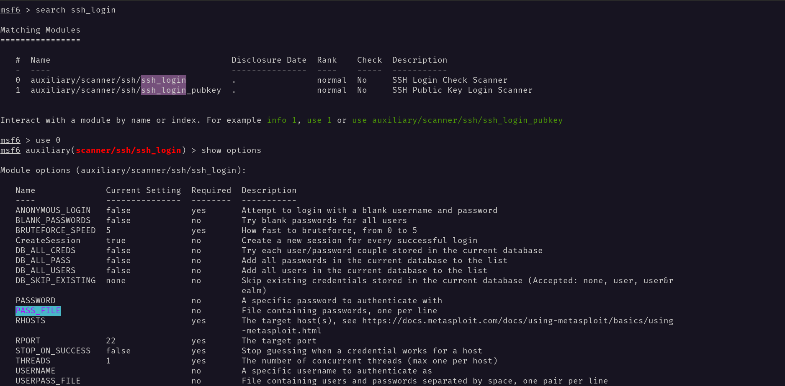

I have created a file called username.txt and password.txt and stored a list of username and password in that file.


I used these files to find the username and password using brute force. After many attempts the username and password service was successful and I was able to login into the server and create files inside the server, I created a file called ranjung.

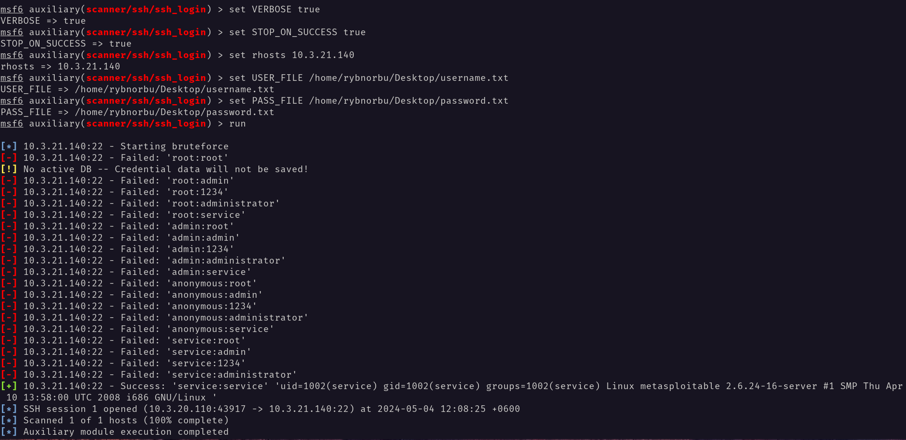

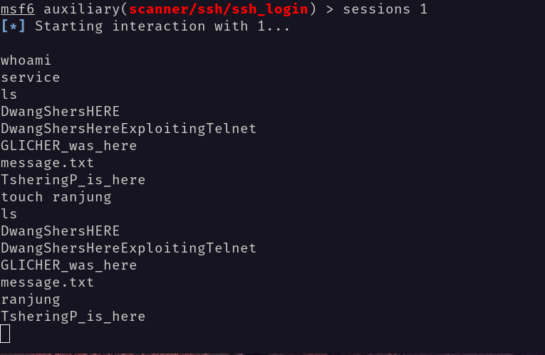

Using some random or common username and password is not a good practice because it makes it easier for attackers to gain unauthorized access. It is important to use strong and unique passwords for each account to enhance security. Using the outdated version of the server can lead to loss of information and unauthorized access and using multi-factor authentication can also provide an extra layer of protection against unauthorized access.

### Postgresql exploit

I was able to exploit the Postgresql port 5432 using the Metasploit module 'Postgres login'. I was able to find the username and password to login to the server. 

Using the module 'Postgres_login' I have set up the necessary options and run the exploits. After setting up the username as Postgres I used the user and pass file the same as the ssh exploit option. 
 

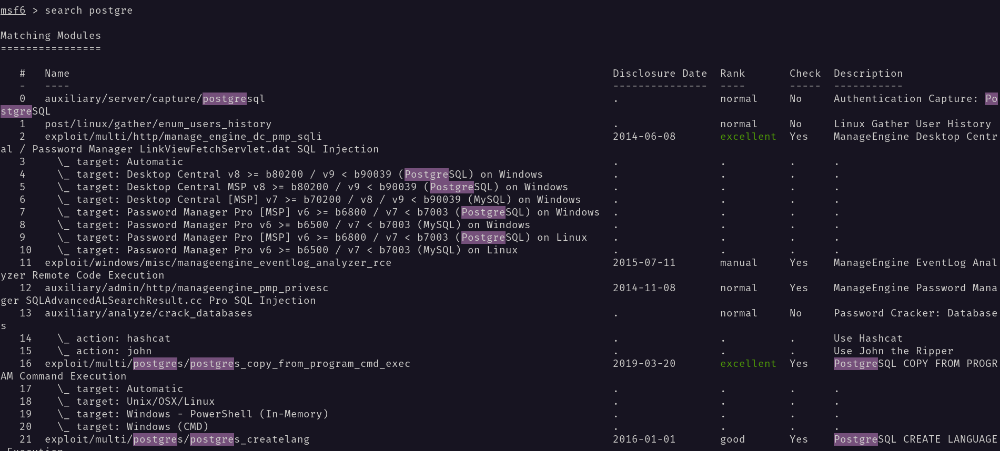

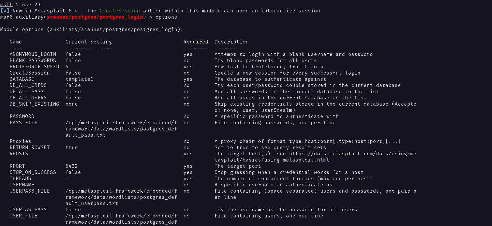

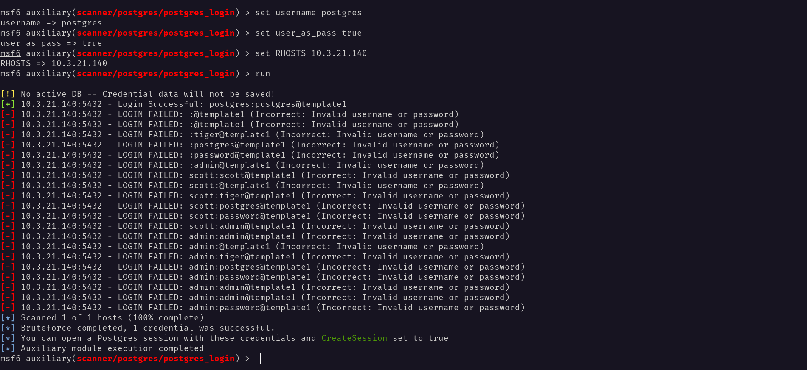

After running the exploit It was successfull and I was able to login to the server as postgres user.

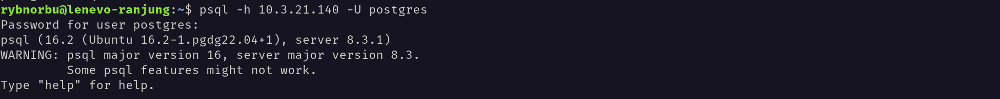

I was create and see the databases and the tables inside the database. I have created a table called 'cyberpunk' and inserted some values inside the table.

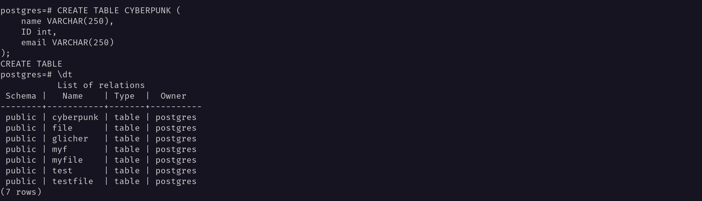

Implementing password policies, and network segmentation to limit the exposure of the PostgreSQL server can reduce the vulnerabilities and protect the server from unauthorized access.

### Reverse shell

From the terminal I was able to upload a file on the machine in dav directory. I have uploaded a file called 'new.php' in the dav directory. After running the netcat command I failed. I was not able to get the reverse shell.

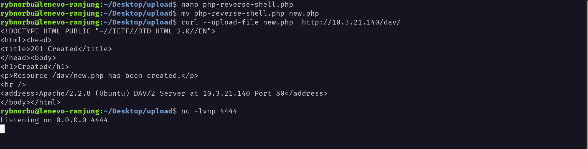

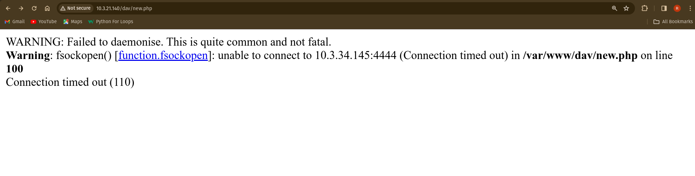

### Telnet

In the port 23 telnet server I used metasploit to exploit the server. I used the module 'telnet_login' to exploit the server. 
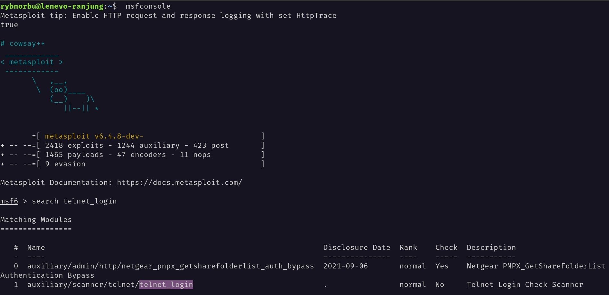

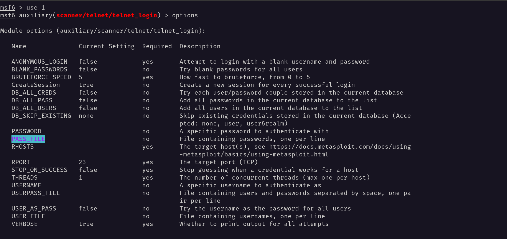

I have set up the necessary options and run the exploit. Again I used the username and password file same as the ssh server. 
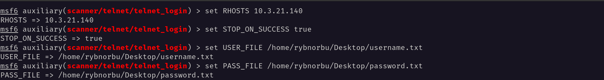

After many attempts It was successful and I was able to login to the server and run the commands.

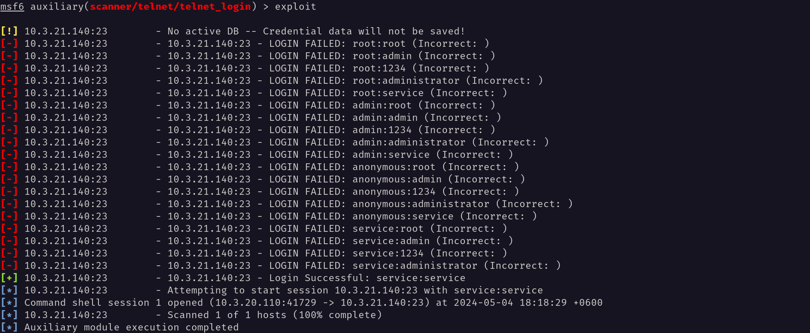

Inside the telnet server I have created a file called "ranjung_in_telnet".

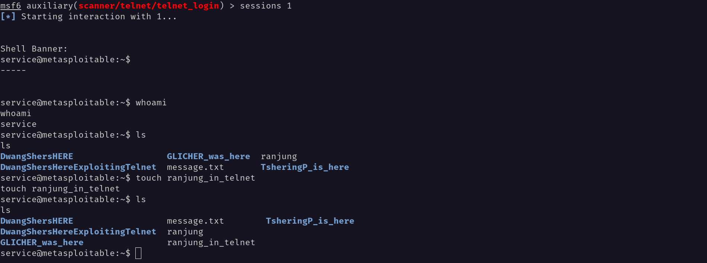


### MySQL

In port 3306 Mysql server is running. I was able to exploit the MySQL server and gain access to the server. Just by using the username as root, I was able to log in to the server. Inside the dvwa database, I was able to find the user's table and the password hash of the users.  

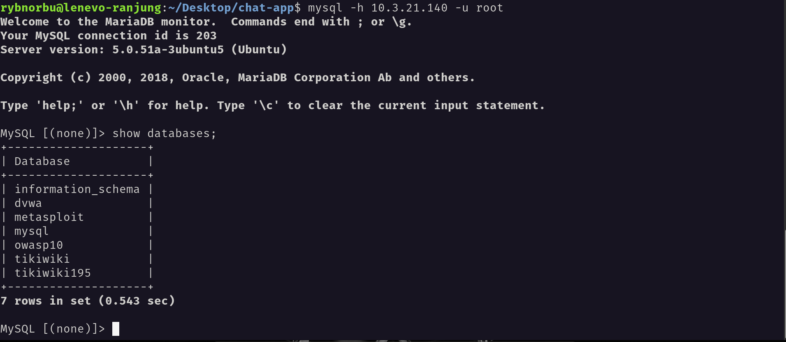

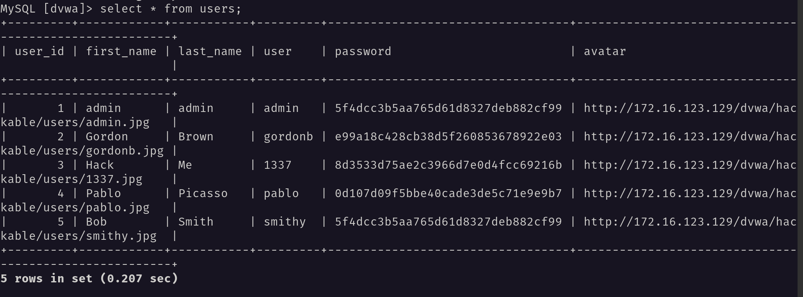

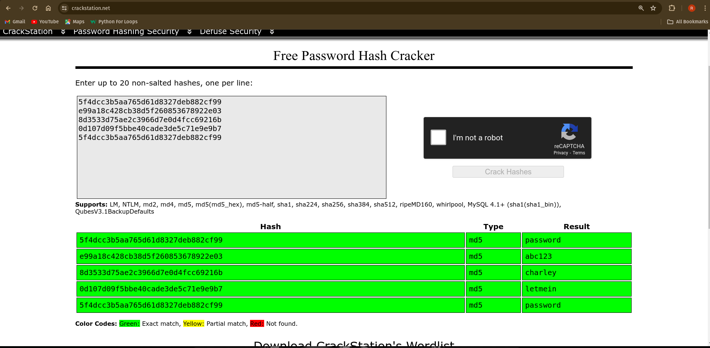

It didn't even take 1 minute to exploit this server. On my first attempt, I was able to login to the server. This can be resolved by updating the MySQL server using a strong and unique password and username.

## Remediation Summary

### Vulnerability Description:

The port 22 hhtp has a critical vulnerability in the Apache web server 2.2.8 that allows remote code execution with elevated privileges. This vulnerability could enable an attacker to gain full control of the affected system.

    rybnorbu@lenevo-ranjung:~$ searchsploit apache 2.2.8 | grep php
    Apache + PHP < 5.3.12 / < 5.4.2 - cgi-bin Remote Code Execution                                                                                             | php/remote/29290.c
    Apache + PHP < 5.3.12 / < 5.4.2 - Remote Code Execution + Scanner                                                                                           | php/remote/29316.py


### Remediation Recommendation:

This can be improved by apply the latest security patch for Apache web server (version 2.4.50 or higher) and ensure that all web servers are updated to the latest version.

### Remediation Summary

Most of the ports that are running on the server have many vulnerabilities such that attackers can create or uploads files on many ports and gain unauthorized access to the server. Exposing this vulnerability can make easy task for hackers and can lead to loss of information and unauthorized access. So, to prevent this make sure to update up to the latest version.


## Recommendations

The server has many vulnerabilities and it is recommended to update the server and patch the vulnerabilities. Using the outdated version of the server can lead to loss of informations and gain unauthorized access. And also using multi-factor authentication can also provide an extra layer of protection against unauthorized access.

## Conclusion

I was able to exploit atleast 4 ports and gain access to the server. The sever has many vulnerabilities and it is recommended to update the server and patch the vulnerabilities. It indicates that the machine has many vulnerabilities that could be exploited by many tools in many ways. 

It is important to note that it is mendatory to update the server up to latest version to prevent unauthorized access and loss of informations. Failure to do so will lead to serious consequences, such as unauthorized access, loss of sensitive information, and reputational damage.


