# Website Penetration Test Assessment

# URL 1: 10.3.21.141:8000 (Gruyere)

## Vulnerability 1 Title

* Path Transversal

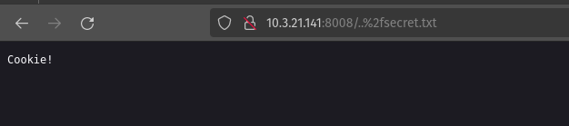

## Vulnerability 2 Title

* File upload vulnerabilities

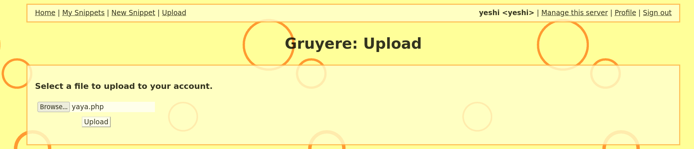

## Vulnerability 3 Title 

* Cross-Site Request Forgery (XSRF/CSRF)

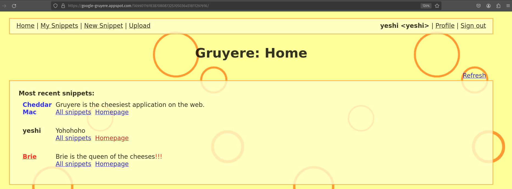

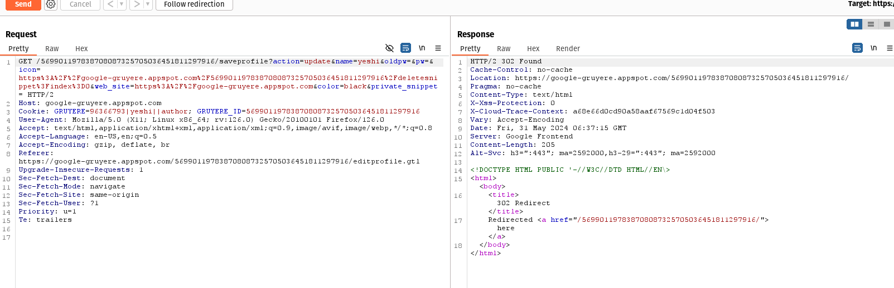

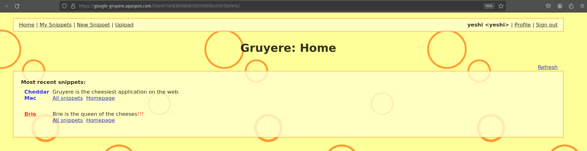

# 10.3.21.141:8008 (Pixi)

## Vulnerability 1 Title

* Insecure Direct Object Reference(IDOR)

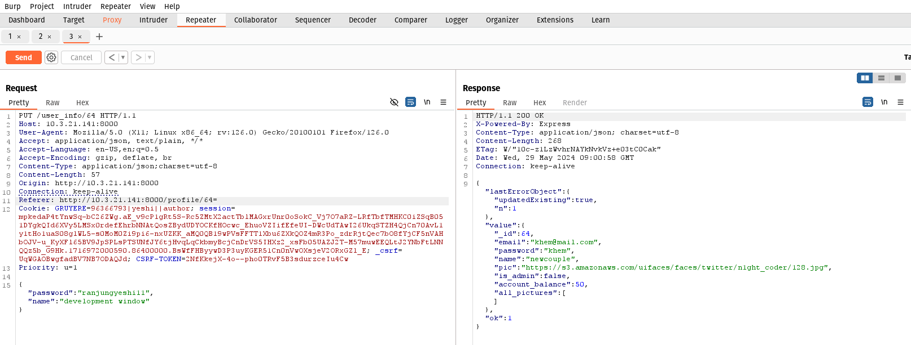

##  Vulnerability 2 Title

* File upload vulnerabilities

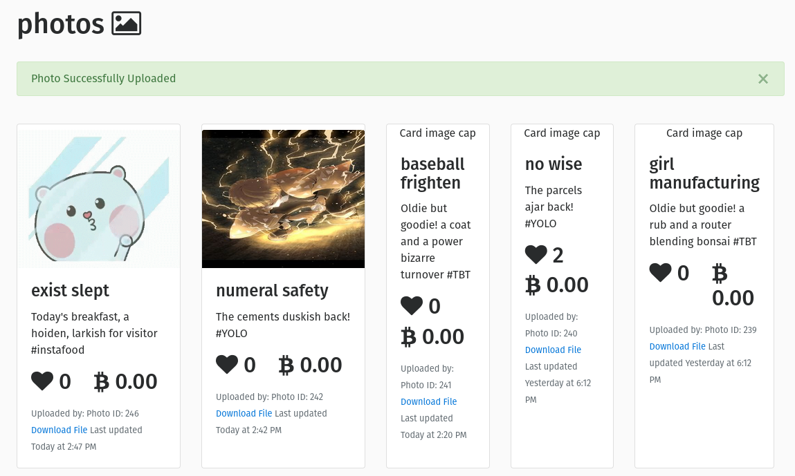

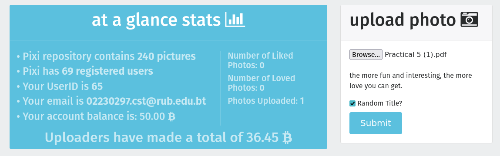

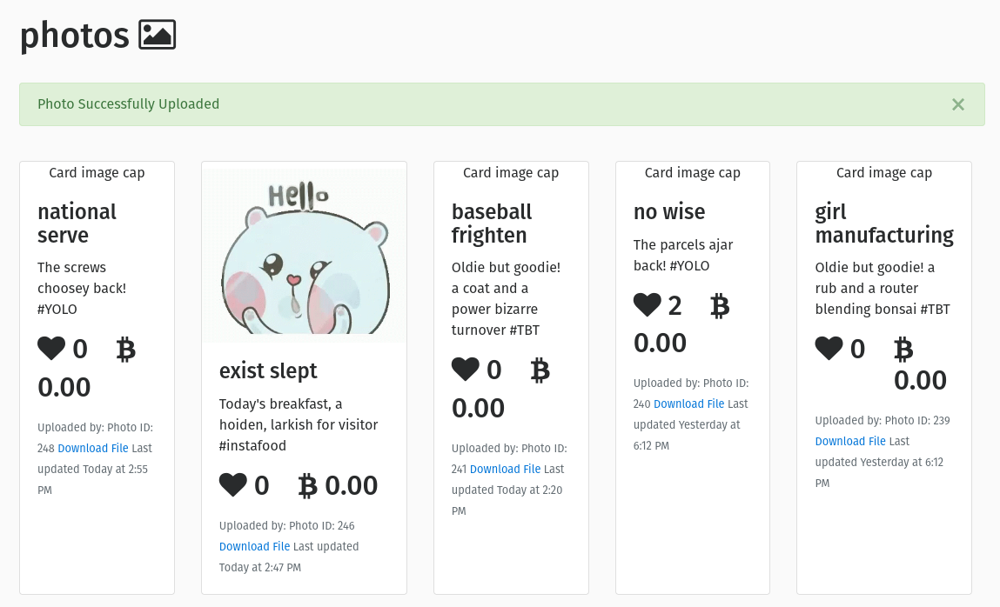

##  Vulnerability 3 Title

* XSS on search field

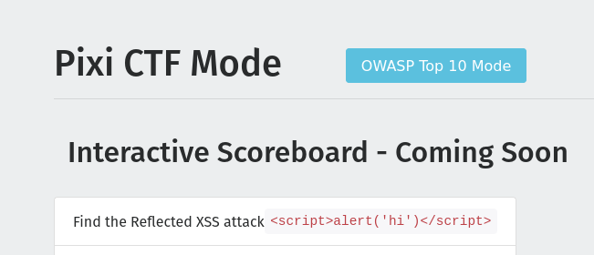

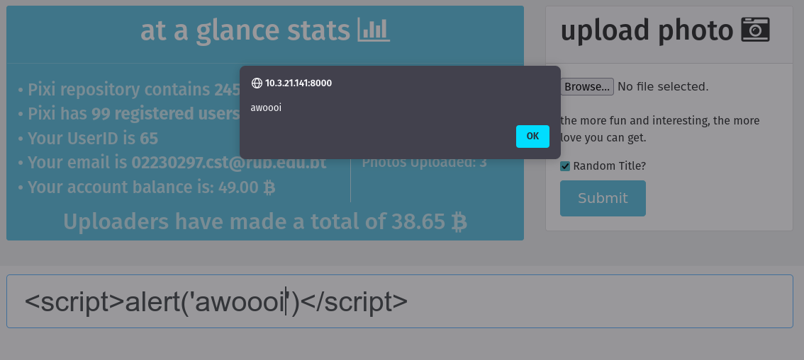

## www.hackthissite.org

### Level 1

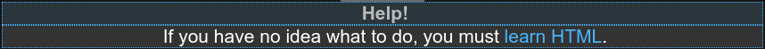

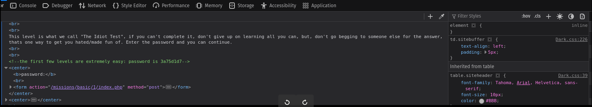

### Level 2

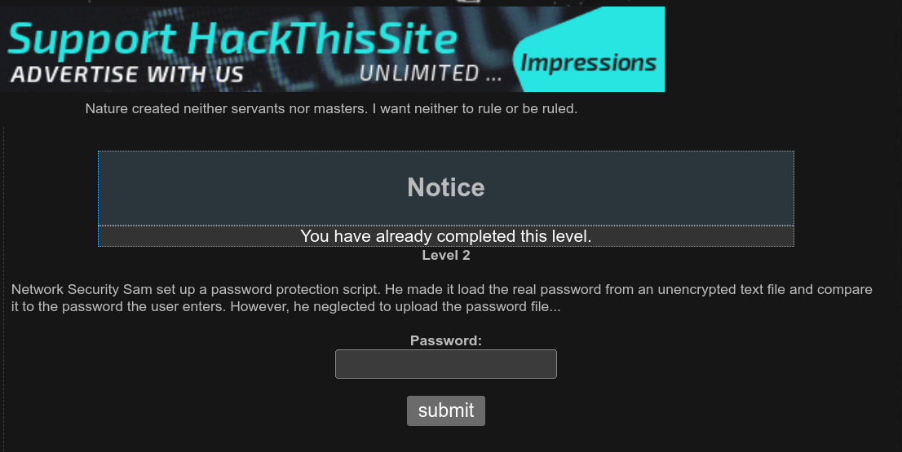

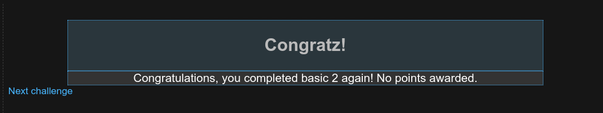

### Level 3

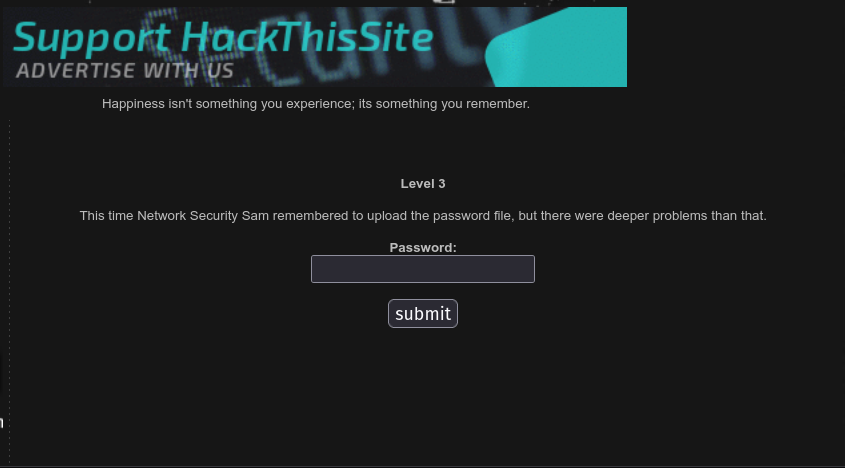

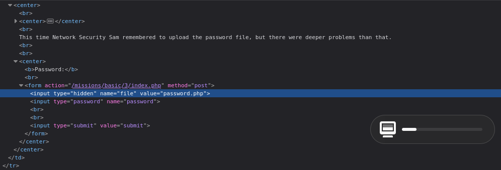

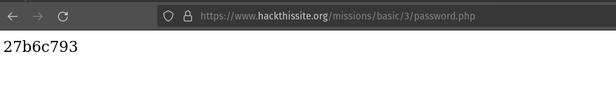

### Level 4

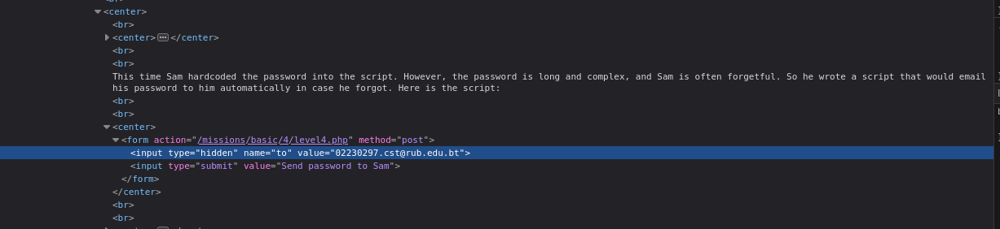

### Level 5

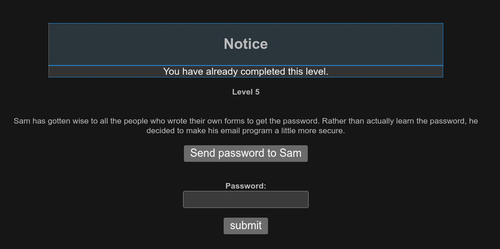

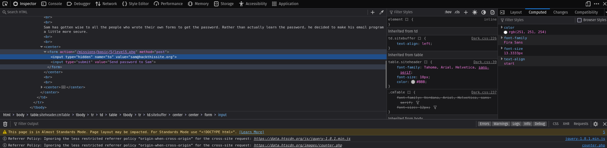

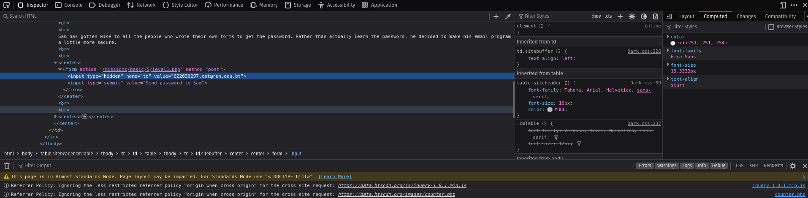

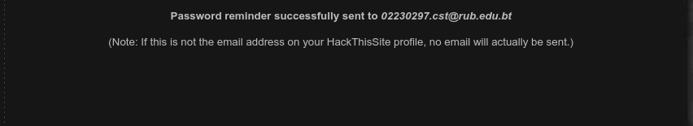

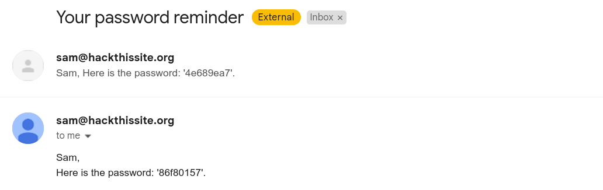