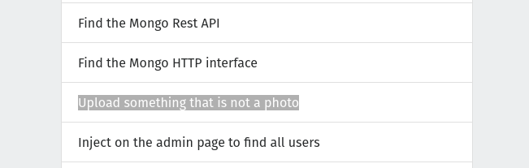

# Website Penetration Test Assessment

# URL 1: 10.3.21.141:8000 (Gruyere)

## Vulnerability 1 Title

* Path Transversal

## Vulnerability 2 Title

* File upload vulnerabilities

## Vulnerability 3 Title 

* Cross-Site Request Forgery (XSRF/CSRF)

# 10.3.21.141:8008 (Pixi)

## Vulnerability 1 Title

* Insecure Direct Object Reference(IDOR)

##  Vulnerability 2 Title

* File upload vulnerabilities

##  Vulnerability 3 Title

* XSS on search field

## www.hackthissite.org

### Level 1

### Level 2

### Level 3

### Level 4

### Level 5

